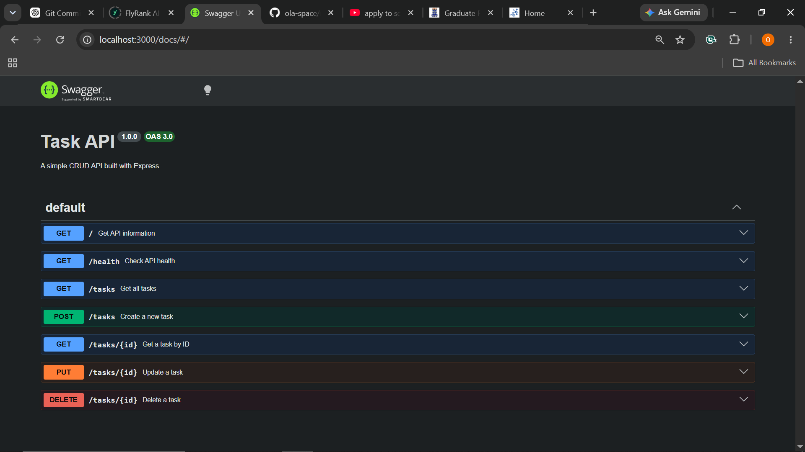

# Task Management REST API

A simple RESTful Task Management API built with **Node.js**, **Express.js**, and **Swagger UI**.

This project demonstrates the complete **CRUD (Create, Read, Update, Delete)** lifecycle for a REST API. It includes request validation, appropriate HTTP status codes, and interactive API documentation using **OpenAPI (Swagger)**.

---

## Features

- RESTful API built with Express.js
- Create, Read, Update, and Delete (CRUD) tasks
- Input validation for task creation and updates
- Proper HTTP status codes (200, 201, 204, 400, 404)
- Interactive API documentation with Swagger UI
- JSON request and response handling

---

## Technologies Used

- Node.js
- Express.js
- Swagger UI Express
- OpenAPI 3.0
- JavaScript
- JSON

---

## Installation

### 1. Clone the repository

```bash
git clone https://github.com/ola-space/task-management-rest-api.git
```

### 2. Navigate into the project folder

```bash
cd task-management-rest-api
```

### 3. Install the project dependencies

```bash
npm install
```

---

## Running the Project

Start the server:

```bash
node index.js
```

If successful, you should see:

```text
Example app listening on port 3000
```

Open your browser and visit:

- **API:** http://localhost:3000
- **Swagger UI:** http://localhost:3000/docs

---

## API Endpoints

| Method | Endpoint | Description |
| :----- | :------- | :---------- |
| GET | `/` | Get API information |
| GET | `/health` | Check API health |
| GET | `/tasks` | Get all tasks |
| GET | `/tasks/:id` | Get a task by ID |
| POST | `/tasks` | Create a new task |
| PUT | `/tasks/:id` | Update an existing task |
| DELETE | `/tasks/:id` | Delete a task |

---

## Example cURL Request

The following command retrieves all tasks from the API.

```bash
curl -i http://localhost:3000/tasks
```

Example response:

```http
HTTP/1.1 200 OK
Content-Type: application/json; charset=utf-8

[
  {
    "id": 1,
    "title": "Learn Express",
    "done": false
  },
  {
    "id": 3,
    "title": "Build Task API",
    "done": false
  },
  {
    "id": 4,
    "title": "Buy milk",
    "done": false
  }
]
```


### Get all tasks

```bash
curl -i http://localhost:3000/tasks
```

### Example Response

```http
HTTP/1.1 200 OK
Content-Type: application/json; charset=utf-8

[
  {
    "id": 1,
    "title": "Learn Express",
    "done": false
  },
  {
    "id": 3,
    "title": "Build Task API",
    "done": false
  },
  {
    "id": 4,
    "title": "Buy milk",
    "done": false
  }
]
```

---

## Swagger Documentation

Swagger UI provides interactive API documentation where you can test every endpoint directly from your browser.

Visit:

http://localhost:3000/docs

### Swagger Screenshot



---

## Project Structure

```text
task-management-rest-api/
├── node_modules/
├── index.js
├── openapi.json
├── package.json
├── package-lock.json
└── README.md
```

---

## Repository

GitHub Repository:

https://github.com/ola-space/task-management-rest-api

---

## Author

**Babatunde Olanipekun**

GitHub: https://github.com/ola-space
